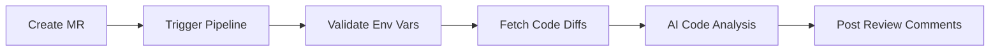

# GitLab AI Code Reviewer

Automated AI code review tool that triggers automatically on Merge Request creation.

## Features

- ✅ Automatic detection of Merge Request events
- ✅ Extract code change diffs
- ✅ AI-powered code review
- ✅ Automatic review comments posted to MR

## Setup Instructions

### 1. Configure Required CI/CD Variables

Configure the following environment variables in your GitLab project:

**Settings > CI/CD > Variables**

#### PAT (Personal Access Token)

1. Create a Personal Access Token:
   - Visit: `https://git.sample.com/-/user_settings/personal_access_tokens`
   - Click **Add new token**
   - Token name: `gitlab-ai-reviewer`
   - Scopes: Select `api` and `read_api`
   - Click **Create personal access token**
   - **Copy the generated token**

2. Add the variable to your project:
   - Key: `PAT`
   - Value: Paste the token copied above
   - Type: Variable
   - ✓ Mask variable (recommended)
   - ✓ Protect variable (optional)

#### OPENAI_API_KEY

- Key: `OPENAI_API_KEY`
- Value: Your OpenAI API Key
- Type: Variable
- ✓ Mask variable (recommended)

### 2. Optional CI/CD Variables

The following variables have default values and can be overridden if needed:

- **GITLAB_BASE_URL**: GitLab server URL (default: `https://git.sample.com`)
- **OPENAI_API_BASE**: OpenAI API base URL (default: `https://one-api.sample.com/v1`)

### 3. Configuration Verification

After configuration, create a test Merge Request. The pipeline will:

1. Validate all required environment variables
2. Display clear error messages and exit if variables are missing
3. Print configuration info (sensitive values are hidden)
4. Execute AI code review
5. Post review comments to the MR

## Workflow



## Sample Log Output

```bash
=== Validating Required Environment Variables ===
✓ PAT configured
✓ OPENAI_API_KEY configured

=== Configuration Info ===
GITLAB_BASE_URL = https://git.sample.com
OPENAI_API_BASE = https://one-api.sample.com/v1
PAT = [Configured]
OPENAI_API_KEY = [Configured]

=== Merge Request Info ===
CI_PROJECT_PATH = root/wt-k8srunner
CI_MERGE_REQUEST_IID = 1
CI_MERGE_REQUEST_TITLE = Edit .gitlab-ci.yml
...

=== Starting AI Code Review ===
=== Loading Configuration ===
✓ PAT configured
✓ OPENAI_API_KEY configured
GitLab URL: https://git.sample.com
OpenAI API Base: https://one-api.sample.com/v1
=== Configuration Loaded ===
```

## Security Best Practices

- ✅ Always use CI/CD Variables to store sensitive information
- ✅ Enable "Mask variable" to prevent log leakage
- ✅ Enable "Protect variable" for production environments
- ❌ Never hardcode tokens in code
- ❌ Never print full sensitive values in logs

## Troubleshooting

### Error: PAT environment variable not set

**Cause**: PAT not configured in GitLab CI/CD Variables

**Solution**: Follow step 1 above to configure the PAT variable

### Error: 401 Unauthorized

**Cause**: Invalid PAT token or insufficient permissions

**Solution**: 
1. Check if the token has expired
2. Verify the token has `api` and `read_api` permissions
3. Regenerate the token and update the CI/CD variable

### Error: OPENAI_API_KEY environment variable not set

**Cause**: OpenAI API Key not configured

**Solution**: Add OPENAI_API_KEY to CI/CD Variables

## Tech Stack

- Python 3.9
- GitLab API (python-gitlab)
- OpenAI API
- GitLab CI/CD

## License

Internal use project
